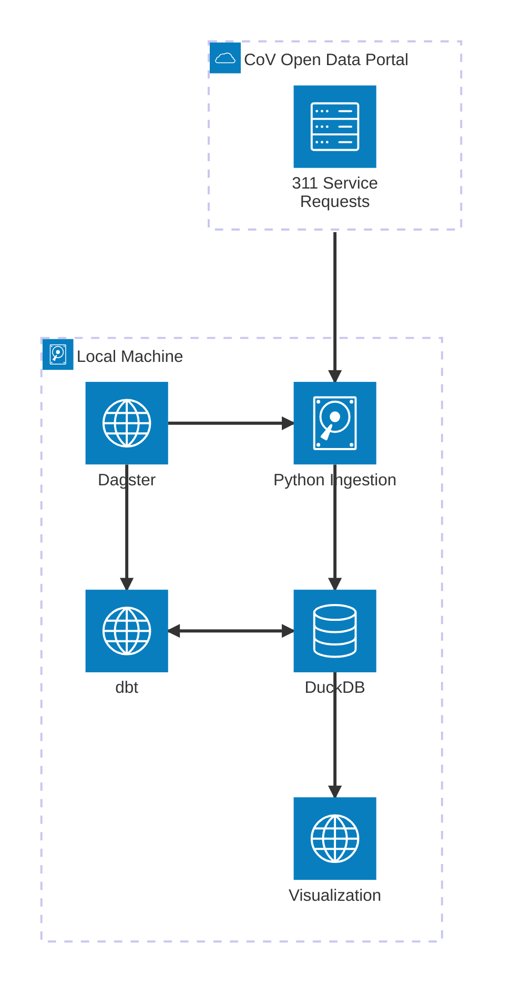

# Modern Minature Data Stack
### Motivation & Project Summary

In my almost 5 years of work experience at EA Games, and particularly in 2 years as a full-time data engineer, the majority of my time interfacing with the many different types and sources of data we dealt with was spent working within the Databricks ecosystem. 

While Databricks continues to expand their feature offerings, I'm left with the distinct feeling that, particularly given my analysts roots, I have some gaps in my knowledge around the full, end-to-end data process, from raw files derived from an external source to data-driven insights. 

This project serves as an opportunity for me to both fill in those gaps, and showcase the understanding I've developed since then through my personal study of the various tools and concepts. 

This project seeks to showcases a modern, miniaturized data stack using a composable architecture, enabling rudimentary analysis and visualization from a simple, open datasource.

This project also hopes to highlight the tradeoffs that data teams need to make when choosing between platform-centric approaches (e.g., Snowflake, Databricks) and composable architectures. Using a light-weight, locally-executable stack that prioritizes transparency, modularity, and a simple developer experience.

The scale and complexity of the data is kept intentionally contrived, in part to keep focus on the architectural choices, and also as a pragmatic consideration for the poor hardrive of my personal laptop (or cloud compute costs on my poor unemployed wallet).

### Architecture

### Tooling

|Layer|Tool|Reasoning|Alternatives|
|---|---|---|---|
|**Ingestion** | Python |Transparent, controllable, replicates low-level connector behavior | Fivetran, Airbyte, Meltano|
|**Storage**|DuckDB| SQL-native OLAP engine, ideal for dev and local experimentation|Databricks, Snowflake, AWS Aurora, MongoDB, Cassandra, etc.|
|**Transformation** |dbt Core| Modular, with built-in support for testing and data lineage|Python, Databricks (Pyspark), Snowflake, even stored procedures|
|**Orchestration**|Dagster| Strong type system, asset-aware, modern DX for data engineers|Airflow, Prefect, Databricks workflows|
|**Exploration**|Streamlit| Lightweight, interactive interface to showcase outputs, web apps built in python|PowerBI, Tableau, Looker, or even other python libraries like dash|

### Data Use Case
The process starts with a `Python Ingestion` script requesting data from the City of Vancouver's [Open Data Portal](https://opendata.vancouver.ca/pages/home/), writing to a local instance of `DuckDB`.

For this project, I chose the 3-1-1 (non-emergency police line) service requests API [endpoint](https://opendata.vancouver.ca/explore/dataset/3-1-1-service-requests/). I chose this particular endpoint because the data is updated frequently, thus requiring regular ingestion and job orchestration, and also because it's kinda neat to see what people are complaining about.

Speaking of orchestration, both ingestion and `dbt` transformations are managed by `Dagster`, the latter of which both reads from and writes to the local `DuckDB` instance, performing basic enrivhment in a medallion architecture, the top layer of which acts as a source for the `Visualization` layer.

### Key Engineering Practices
Orchestration via Dagster: Uses software-defined assets and IO managers; clear asset lineage and runtime type checking

Transformations in dbt: Modular SQL models with tests and docs

Storage in DuckDB: File-based OLAP store for quick iteration

Local-first development: All tools run on a laptop or container

Reproducibility: Ingestion and model runs are deterministic and tracked

### Future Improvements
Introduce Airbyte or Meltano for ingestion abstraction

Use Postgres or BigQuery to simulate production-scale warehouses

Add data quality layer (e.g., great_expectations, dbt-expectations)

Incorporate CI/CD workflows for dbt models and Dagster pipelines

Expand asset graph to include ML feature pipelines or reverse ETL use case

### Final Thoughts
This project reflects how I think about data architecture, engineering trade-offs, and developer experience. It demonstrates my ability to work across the stack—from ingestion logic to transformation logic to orchestration strategy—and make thoughtful choices about tools and patterns that balance flexibility, maintainability, and scale.

**P.S.**
Can you tell these last three sections were written by chatGPT and I haven't bothered to use my own words yet?
